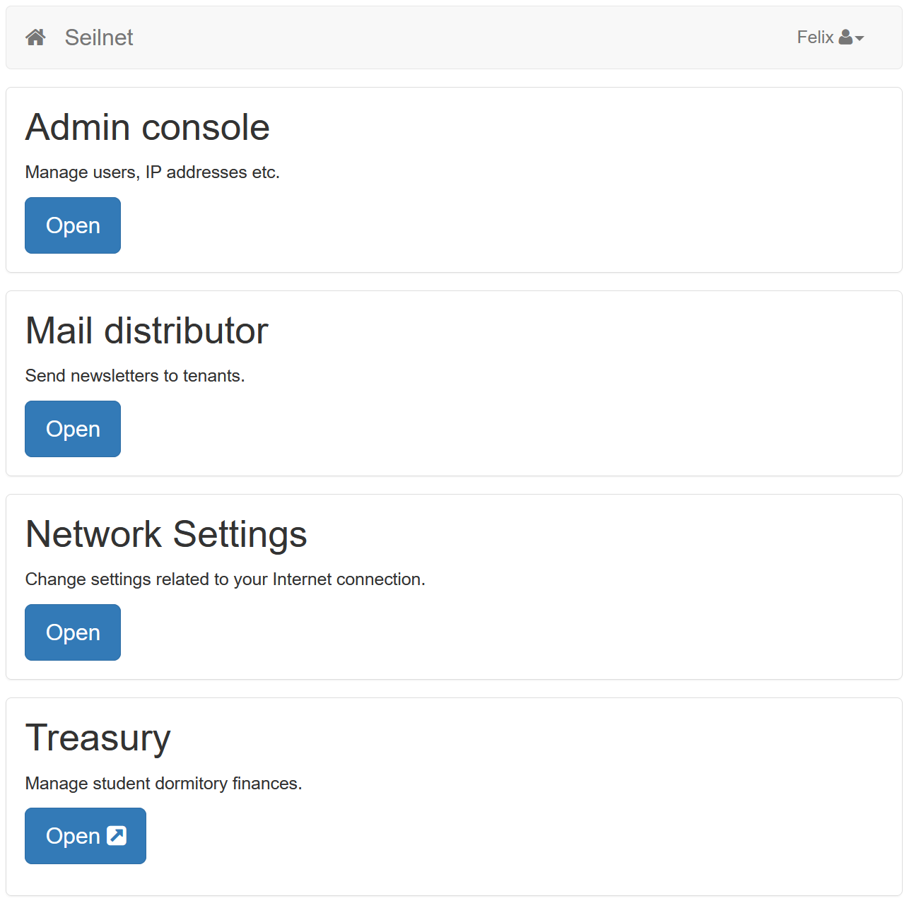
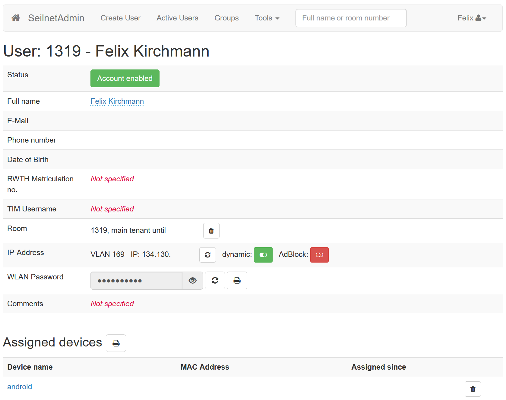
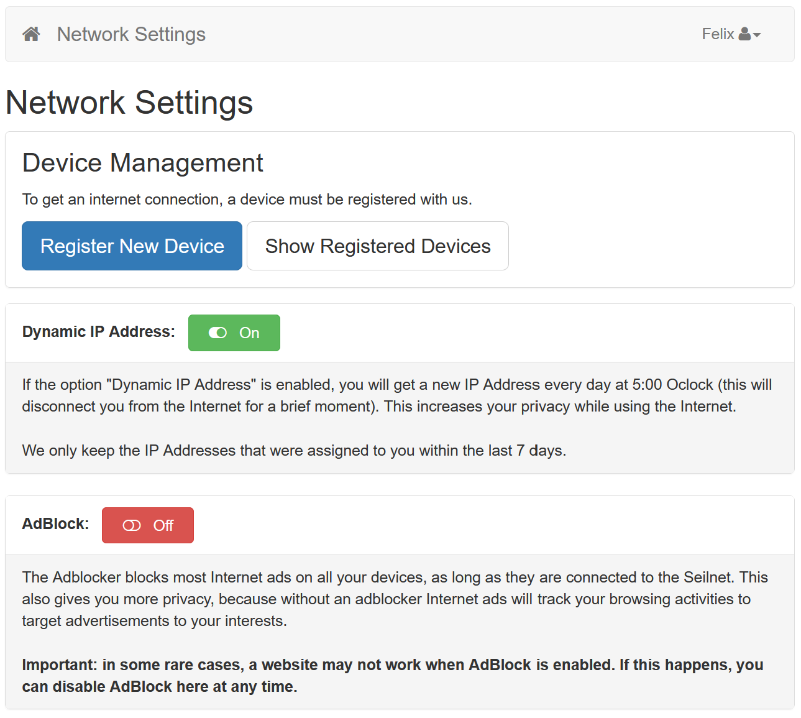

# Seilnet




A web app I developed to manage our residence hall: efficiently automates user, WiFi & firewall management, integrated with iptables & FreeRADIUS. Provides Single Sign-On for several other apps and a user self-service portal.

## Starting the application
1. Install docker and docker-compose
2. Check out this project from git:
```
git clone https://github.com/fkirchmann/Seilnet.git
```
3. Run the following command in the root of the project:
```
docker-compose up
```
4. You can now access Seilnet at [http://localhost:45678](http://localhost:45678)

## Features
- Provides an intuitive Web UI to manage Users, Groups & IP Addresses
- Provides a self-service portal to users to manage their own devices & internet settings
- Dynamic IPv4 support for enhanced privacy: IPs can be rotated daily, mappings are retained for as long as legally required
- A firewall daemon automatically applies IP address mappings & allowed devices to iptables rules
  - Instantly reports available devices, 
allowing the user to easily allow them
- API for FreeRADIUS allows WiFi Enterprise authentication, with support for RADIUS-based VLANs
- Multilanguage support: English & German
- Mailing tool allows sending E-Mails to tenants without exposing their E-Mail addresses
- Can provide SSO for other applications
- Optimized docker build allows for easy and fast deployment

If you're interested in using this application for your residence hall, please contact me!

## Technology Stack
- Java
- MySQL / MariaDB
- Liquibase
- Pebble Template Engine
- Bootstrap
- jQuery
- Can interface with iptables & FreeRADIUS' rlm_rest module
- Docker & BuildKit & docker-compose